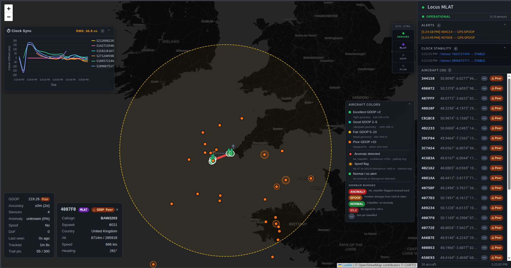
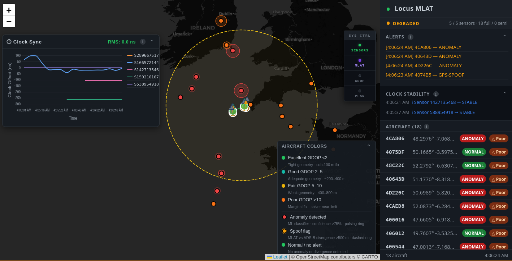
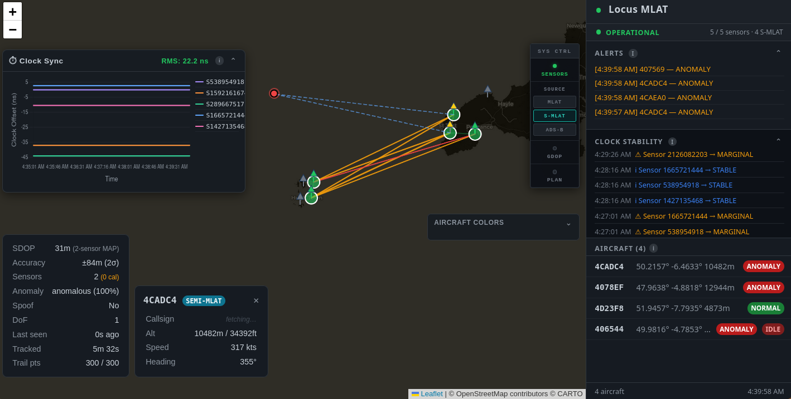
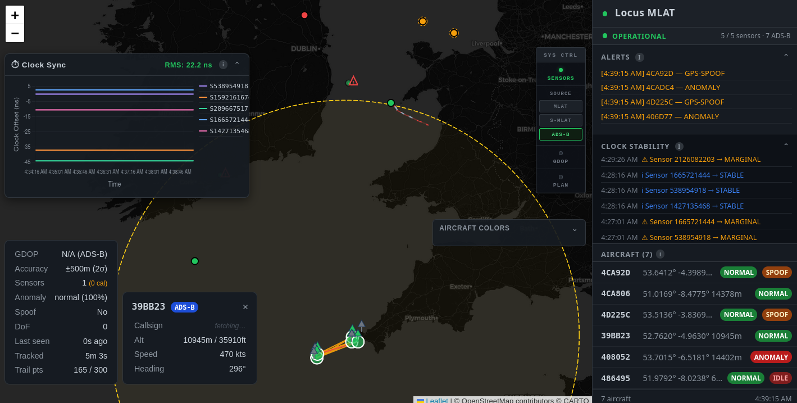
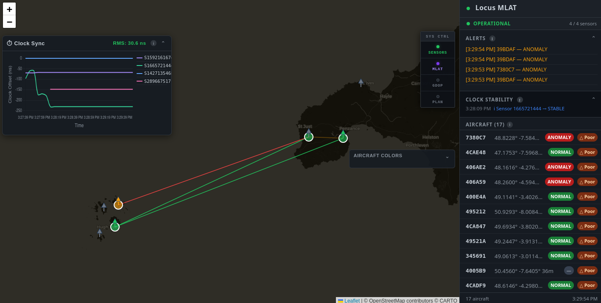
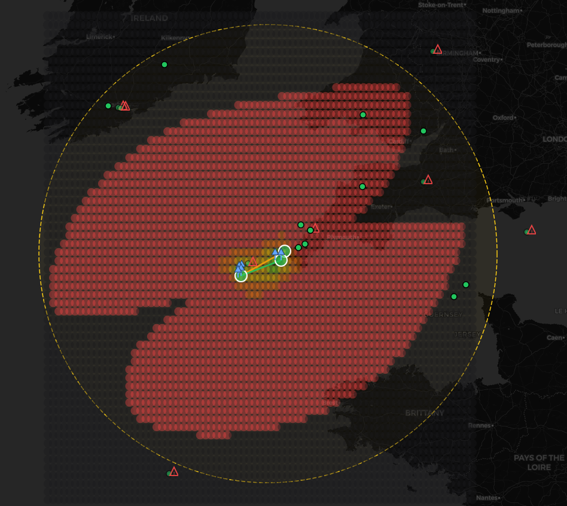
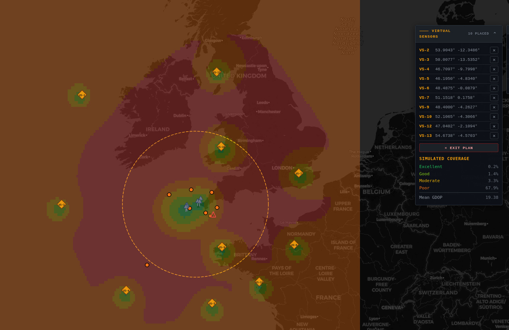
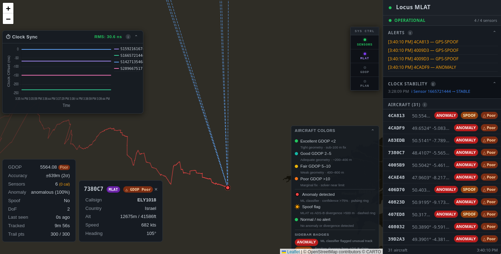

<p align="center">
  
</p>

<h3 align="center">Real-Time Aircraft Multilateration, Airspace Observability Platform & Spoofing Detection</h3>

<p align="center">
  
  
  
  
</p>

<p align="center">
  <a href="#demo">Demo</a> •
  <a href="#features-at-a-glance">Features</a> •
  <a href="#architecture-overview">Architecture</a> •
  <a href="#subsystem-deep-dives">Deep Dives</a> •
  <a href="#getting-started">Getting Started</a> •
  <a href="#references">References</a>
</p>

---

## Demo

<p align="center">
  <a href="https://www.youtube.com/watch?v=3yB2SLVSIskc">
    
  </a>
  <br/>
  <em>Click to watch the full demo on YouTube</em>
</p>

---

## What is Locus?

Locus is a **from-scratch, real-time multilateration engine** that locates aircraft using the time difference of arrival (TDOA) of Mode S transponder signals at distributed ground sensors — no GPS required on the tracking side. It goes far beyond basic positioning:

- **Three observation modes** — full MLAT (3+ sensors), semi-MLAT (2 sensors + Kalman prior), and direct ADS-B decode — fused through a unified Kalman filter
- **Graph-based global clock synchronization** that enforces transitivity across the entire sensor network, achieving sub-10ns consistency
- **GDOP heatmap engine** that reveals coverage quality across geographic space *before* aircraft fly through it, with interactive virtual sensor placement for infrastructure planning
- **GPS spoofing detection** by cross-referencing independent MLAT positions against ADS-B claimed positions
- **LSTM anomaly classifier** that identifies spoofed tracks, replay attacks, and position-frozen transmissions from trajectory patterns
- **Live web dashboard** with real-time aircraft tracks, sensor topology visualization, clock health monitoring, and airspace observability overlays

The entire backend is written in **Rust** for deterministic, sub-millisecond latency on every frame. The ML inference service runs as a sidecar **Python/PyTorch** microservice.

---

## Features at a Glance

| Feature | Description |
|---|---|
| **Full MLAT Solver** | 4-variable Levenberg-Marquardt pseudorange formulation with WGS84 altitude constraints, per-measurement error weighting, SVD geometry screening, and Rayon-parallelized GDOP |
| **Semi-MLAT (2-Sensor)** | MAP estimation fusing single TDOA hyperbola with Kalman temporal prior — expands coverage from 0% to 60-80% in sparse zones |
| **ADS-B Decode** | Full CPR position decoding (even/odd frames), Gillham Gray code altitude, CRC-24 verification, NUC quality extraction |
| **Global Clock Solver** | Graph Laplacian least-squares with IRLS outlier rejection, Allan deviation oscillator classification, and condition number monitoring |
| **GDOP Heatmap** | Rayon-parallelized theoretical coverage field at configurable altitude; SVD-based degeneracy detection; 6-level quality classification |
| **Virtual Sensor Planner** | Click-to-place hypothetical sensors on the map and instantly see how coverage improves — per-client isolation, zero production contamination |
| **Kalman Tracking** | 6-state EKF (position + velocity) in ECEF with Mahalanobis outlier gating, altitude clamping, and velocity divergence detection |
| **Spoof Detection** | GDOP-adaptive threshold comparing MLAT-independent position against ADS-B claimed position — flags divergence > max(2 km, 3σ) |
| **LSTM Anomaly Classifier** | Bidirectional LSTM trained on synthetic spoofing profiles (position jumps, velocity flips, altitude teleports, frozen replays) with GDOP and divergence features |
| **Live Dashboard** | Leaflet map with aircraft tracks, sensor topology overlay, clock health bar charts, GDOP heatmap toggle, coverage statistics, and stability alert panel |
| **OpenSky Enrichment** | On-demand callsign, squawk, and origin country lookup with 5-minute TTL cache |

---

## Architecture Overview

```
                              ┌────────────────────────────────┐
                              │   4DSky LibP2P Network (QUIC)  │
                              └────────────────┬───────────────┘
                                               ↓
                              ┌────────────────────────────────┐
                              │  go-ingestor (Mode S parser)   │
                              │  • GPS correction via override │
                              │  • Binary → JSON transform     │
                              └────────────────┬───────────────┘
                                               ↓ Unix Socket (/tmp/locus/ingestor.sock)
          ┌──────────────────────────────────────────────────────────────────────────┐
          │                     rust-backend (MLAT Engine Core)                      │
          │  ┌──────────────┐  ┌──────────────┐  ┌──────────────┐  ┌──────────────┐  │
          │  │ Correlator   │→ │  ADS-B       │→ │ Clock Sync   │→ │ MLAT Solver  │  │
          │  │ (200ms win)  │  │  Decoder     │  │ (dual-mode)  │  │ Full + Semi  │  │
          │  └──────────────┘  └──────────────┘  └──────────────┘  └──────────────┘  │
          │         ↓                   ↓                                  ↓         │
          │  ┌──────────────┐  ┌──────────────┐  ┌──────────────┐  ┌──────────────┐  │
          │  │ ADS-B Track  │  │ Kalman EKF   │  │ Spoof Detect │  │  GDOP Heat   │  │
          │  │ (fallback)   │  │ (6-state)    │  │ MLAT vs ADS  │  │  map + Virt  │  │
          │  └──────────────┘  └──────────────┘  └──────────────┘  └──────────────┘  │
          │         ↓                 ↓                 ↓                 ↓          │
          │        ┌───────────────────────────────────────────────────────┐         │
          │        │          WebSocket Broadcast (tokio, 4096 cap)        │         │
          │        └───────────────────────────┬───────────────────────────┘         │
          └────────────────────────────────────┼─────────────────────────────────────┘
                                               ↓                                ↑
                                  ┌────────────────────────┐                    │
                                  │  ml-service (FastAPI)  │←-------------------┘
                                  │  LSTM Anomaly (8 feat) │ HTTP 8000 (500ms timeout)
                                  └────────────────────────┘
                                               ↓
                                  ┌────────────────────────┐
                                  │  frontend (Leaflet.js) │
                                  │  • 3 tracking modes    │
                                  │  • Virtual sensors UI  │
                                  │  • GDOP heatmap viz    │
                                  └────────────────────────┘
```

### Technology Stack

| Layer | Technology | Rationale |
|---|---|---|
| **Core engine** | Rust (tokio async runtime) | Deterministic sub-ms latency, zero-cost abstractions, fearless concurrency |
| **Linear algebra** | nalgebra + levenberg_marquardt | Native Rust LM solver, no FFI overhead; nalgebra for ECEF/WGS84 transforms |
| **Parallelism** | Rayon (data-parallel) + tokio (async I/O) | CPU-bound GDOP grid on Rayon thread pool; I/O-bound networking on tokio |
| **ML inference** | Python / PyTorch / FastAPI | LSTM anomaly classifier as sidecar microservice; async HTTP bridge from Rust |
| **Frontend** | Leaflet.js + Chart.js | Lightweight real-time map rendering; no build step required |
| **Transport** | WebSocket (tokio-tungstenite) | Low-latency bidirectional streaming; broadcast channel for fan-out |

---

## Mathematical Foundations

Before diving into implementation details, we establish the theoretical foundations that underpin Locus's algorithms. These principles inform design decisions and parameter choices throughout the system.

### TDOA Localization Theory

**The Core Geometry:** Time Difference of Arrival (TDOA) localization exploits the fact that a signal transmitted from position **p** arrives at different sensors at different times. The time difference between sensors *i* and *j* defines a hyperbola in 2D (hyperboloid in 3D) of points equidistant from both sensors:

```
TDOA_ij = (||p - s_i|| - ||p - s_j||) / c
```

where c is the speed of light in air (~299.7 m/μs).

**Why TDOA vs TOA:** Absolute Time of Arrival (TOA) requires knowing the transmission time t₀, which introduces an additional unknown. TDOA eliminates this by considering differences — the transmission time cancels out. This is why MLAT works with unsynchronized transmitters (Mode S transponders don't timestamp their own transmissions).

**Minimum Sensor Requirements:**
- **3D positioning (x, y, z):** Requires 4 sensors minimum → 3 independent TDOAs → 3 equations for 3 unknowns
- **2D + known altitude:** Requires 3 sensors minimum → 2 TDOAs + altitude constraint → 2 equations + 1 constraint for 2 unknowns
- **Locus's 4-variable formulation:** Uses 4 unknowns [x, y, z, offset] symmetrically → N sensors yield N equations (no privileged reference)

**Geometric Dilution of Precision (GDOP):** Position accuracy degrades when sensors have poor geometric diversity (e.g., collinear sensors). GDOP quantifies this degradation:

```
GDOP = √(trace((J^T J)^{-1}))
```

where **J** is the Jacobian of the TDOA measurement function with respect to position. Low GDOP (<2) indicates excellent geometry; high GDOP (>20) indicates near-degenerate geometry. GDOP relates to the Cramér-Rao lower bound — no unbiased estimator can achieve accuracy better than `σ_measurement × GDOP` (Kaplan & Hegarty, 2017).

**References:**
- Foy, W. H. (1976). "Position-Location Solutions by Taylor-Series Estimation." *IEEE Trans. Aerospace Electronic Systems*, 12(2), 187-194.
- Chan, Y. T. & Ho, K. C. (1994). "A Simple and Efficient Estimator for Hyperbolic Location." *IEEE Trans. Signal Processing*, 42(8), 1905-1915.
- Schmidt, R. O. (1996). "Least Squares Range Difference Location." *IEEE Trans. Aerospace Electronic Systems*, 32(1), 234-242.
- Kaplan, E. D. & Hegarty, C. J. (2017). *Understanding GPS/GNSS*, 3rd ed., Chapter 8.

### Clock Synchronization in Distributed Systems

**The Nanosecond Imperative:** MLAT position error is directly proportional to timing error. Since light travels 0.3 meters per nanosecond, a 10 ns clock offset translates to 3 meters of position error. Sub-100 ns synchronization is essential for meter-level accuracy.

**Pairwise vs Global Synchronization:**

| Approach | Transitivity | Variance | Topology Visibility | Scalability |
|----------|--------------|----------|---------------------|-------------|
| **Pairwise OLS** | Not enforced (50-200 ns error) | σ²_pair | None | O(N²) pairs |
| **Global Graph** | Enforced (<10 ns) | σ²_i + σ²_j (20-40% reduction) | Full graph + condition number | O(N³) dense Cholesky, O(N) sparse |

Pairwise methods (e.g., NTP, simple regression) estimate each sensor-pair offset independently. This fails to enforce the constraint that offset chains must be transitive: if A-B = +10ns and B-C = +20ns, then A-C must equal +30ns, not the independently-estimated +35ns. This "closure error" accumulates.

**Graph Laplacian Formulation:** Locus treats the sensor network as a weighted graph where edges represent beacon observations providing offset measurements. The global offset vector **θ** minimizes:

```
J(θ) = Σ_edges w_ij × (measured_diff_ij - (θ_i - θ_j))²
```

This is solved via the normal equations **H·θ = b** where **H = A^T W A** is the graph Laplacian (A = incidence matrix, W = weight matrix). Anchoring θ₀ = 0 reduces to a (N-1) × (N-1) system solved by Cholesky decomposition. The solution inherently enforces transitivity and provides posterior covariance **Σ = (H)^{-1}** for uncertainty quantification.

**Allan Deviation & Oscillator Classification:** Allan deviation characterizes oscillator stability at different averaging times τ. The slope of log(ADEV) vs log(τ) reveals noise type:

- **White phase noise** (slope -1/2): GPS-disciplined oscillators, ADEV(τ) decreases as τ increases
- **Flicker frequency noise** (slope ~0): Crystal oscillators (TCXO), ADEV(τ) flat
- **Random walk** (slope +1/2): Degraded/aging crystals, ADEV(τ) increases as τ increases

Locus computes overlapping Allan deviation at τ ∈ {1, 5, 10, 30, 60} seconds to classify sensor oscillators and predict maintenance needs (e.g., flag sensors transitioning from crystal to random-walk behavior before they corrupt the network).

**References:**
- Allan, D. W. (1966). "Statistics of Atomic Frequency Standards." *Proceedings of the IEEE*, 54(2), 221-230.
- Mills, D. L. (2006). *Computer Network Time Synchronization: The Network Time Protocol*. CRC Press.
- IEEE 1588-2008. *Precision Time Protocol (PTP)* for nanosecond-level synchronization.

### Bayesian State Estimation

**Kalman Filter as Recursive Bayesian Estimator:** The Kalman filter is the optimal recursive estimator (minimum mean-squared error) for linear-Gaussian systems. At each time step, it performs:

1. **Predict:** Propagate state and uncertainty forward using the motion model
2. **Update:** Fuse prediction with new measurement using Bayes' rule

For nonlinear systems (MLAT measurement model is nonlinear in position), the Extended Kalman Filter (EKF) linearizes via first-order Taylor expansion around the current state estimate.

**MAP vs ML vs MMSE Estimators:**
- **Maximum Likelihood (ML):** `p* = argmax p(z | p)` — ignore prior, use only measurement
- **Maximum A Posteriori (MAP):** `p* = argmax p(z | p) × p(p)` — Bayesian fusion of measurement likelihood × prior
- **Minimum Mean-Squared Error (MMSE):** `p* = E[p | z]` — expected value under posterior (Kalman filter for Gaussian case)

For Gaussian distributions, MAP and MMSE coincide. Locus's semi-MLAT solver uses MAP estimation to fuse a single TDOA measurement (underdetermined) with the Kalman temporal prior, resolving the geometric ambiguity.

**Process Noise Role (Maneuver Accommodation):** The process noise covariance **Q** models unmodeled dynamics — in this case, aircraft maneuvers not captured by the constant-velocity model. Too small, and the filter becomes overconfident and rejects valid measurements during turns. Too large, and the filter tracks noise.

The Singer model (Singer, 1970) provides guidance: for a constant-velocity model with maneuver acceleration a_max and correlation time τ, the steady-state process noise is:

```
σ²_a ≈ (2 × a_max² / τ)
```

For commercial aircraft with a_max ~ 3 m/s² and τ ~ 5-10s (time between maneuvers), this suggests σ²_a ~ 2-4 m²/s⁴.

**Mahalanobis Distance & Chi-Squared Gating:** The innovation (measurement residual) should be white noise: `ν ~ N(0, S)` where `S = H·P·H^T + R`. The Mahalanobis distance `M² = ν^T S^{-1} ν` follows a chi-squared distribution with degrees of freedom equal to the measurement dimension. For 3D position measurements, M² ~ χ²(3), so:

- M² < 7.8 → 95% confidence (typical gate)
- M² < 11.3 → 99% confidence
- M² < 225 (15²) → 99.9997% confidence (Locus's permissive gate, prioritizes availability over purity)

The wider gate trades false-negative risk (rejecting valid measurements) for false-positive risk (accepting outliers). The 3-consecutive-outlier reset mechanism provides a secondary safety net.

**References:**
- Kalman, R. E. (1960). "A New Approach to Linear Filtering and Prediction Problems." *Journal of Basic Engineering*, 82(1), 35-45.
- Bar-Shalom, Y., Li, X. R., & Kirubarajan, T. (2001). *Estimation with Applications to Tracking and Navigation*. Wiley, Chapters 5-6.
- Kay, S. M. (1993). *Fundamentals of Statistical Signal Processing, Volume I: Estimation Theory*. Prentice Hall, Chapter 12.
- Singer, R. A. (1970). "Estimating Optimal Tracking Filter Performance for Manned Maneuvering Targets." *IEEE Trans. Aerospace Electronic Systems*, 6(4), 473-483.
- Grewal, M. S. & Andrews, A. P. (2014). *Kalman Filtering: Theory and Practice Using MATLAB*, 4th ed. Wiley.

---

## Subsystem Deep Dives

### 1. Message Ingestion & Correlation

#### Overview

Raw Mode S frames arrive from distributed sensors via a Unix socket ingestor. Each frame carries a sensor ID, nanosecond-precision timestamp, and the raw hex-encoded transponder message. The **correlator** groups frames that represent the *same physical transmission* received at multiple sensors.

#### How It Works

**Correlation key**: `(ICAO24 address, content_hash)` — two frames belong to the same group if and only if they came from the same aircraft and contain the identical payload.

**Supported downlink formats** (not just ADS-B):
- **DF 17/18** (Extended Squitter): ICAO24 in bytes 1-3, CRC must equal zero
- **DF 11** (All-Call Reply): ICAO24 in bytes 1-3, CRC verification
- **DF 4/5/20/21** (Surveillance Replies): ICAO24 extracted via CRC-24 residual — the CRC remainder *is* the address (address/parity field). This enables multilateration of non-ADS-B aircraft that only respond to Mode S interrogations

**Time window**: 200ms (increased from 50ms to capture late-arriving frames from distant sensors). Eviction is driven by frame timestamps, not wall clock, ensuring stability during data gaps.

**Deduplication**: At most one frame per sensor per group. If a sensor sends duplicates (e.g., from multipath), only the first is retained.

**Emission threshold**: Groups with ≥2 sensors are emitted (reduced from 3 to enable semi-MLAT). Groups with <2 sensors are silently dropped.

#### Technical Details

```
CRC-24 Residual Computation (ICAO Doc 9684 §3.1.2.3):
  Generator polynomial: 0xFFF409
  For DF17/18/11: residual = 0 → valid message, ICAO24 in bytes 1-3
  For DF4/5/20/21: residual = ICAO24 address (address/parity encoding)
```

The CRC-24 table is computed once at startup via `OnceLock` and reused across all frame processing — zero runtime allocation.

---

### 2. Full MLAT Solver (≥3 Sensors)

<p align="center">
  
</p>

#### Overview

The core positioning engine. Given TDOA measurements from 3 or more sensors, it estimates aircraft position in 3D ECEF coordinates using a **4-variable pseudorange formulation** solved by Levenberg-Marquardt optimization.

#### Mathematical Formulation

**Classical TDOA** eliminates a reference sensor and solves for 3 unknowns `[x, y, z]`. This makes the reference sensor privileged and can amplify its noise.

**Locus uses a pseudorange formulation** with 4 unknowns `[x, y, z, offset]`:

```
Residuals (n sensors → n equations):
  r[0] = (offset - ||p - s₀||) / σ₀          (reference sensor)
  r[k] = (Δd_k - ||p - s_k|| + offset) / σ_k  (k = 1, ..., n-1)
```

where `offset` absorbs residual clock bias and all receivers contribute symmetrically. This eliminates the privileged-reference problem and improves numerical conditioning.

**WGS84 altitude constraint** (soft, degradation-aware):

```
r_alt = w_alt × (alt_WGS84(p) - alt_ADS-B)

where:
  w_alt = 1 / (76.2m + 21.3 × age_seconds)    [250ft base + 70ft/s degradation]
  Disabled when error > 926m (~12s stale)
```

The altitude Jacobian uses the WGS84 surface normal `n̂ = [cos(φ)cos(λ), cos(φ)sin(λ), sin(φ)]`, avoiding spherical approximation errors.

**Per-measurement error weighting**: Each residual is divided by `σ_k = √(variance_k)` from the clock synchronization engine, giving well-calibrated sensors more influence.

#### Pre-Solve Geometry Screening

Before invoking the iterative solver, a cached SVD analysis screens for degenerate geometry:

| Check | Threshold | Rationale |
|---|---|---|
| Minimum baseline | > 5 km | Sensors too close → poor TDOA resolution |
| Minimum singular value | > 1e-6 | Near-zero → sensors coplanar/collinear |
| Condition number | < 1e8 | Ill-conditioned → unstable solution |
| Centroid GDOP | < 20 | Geometry so poor that solver will waste cycles |

The `GeometryCache` stores SVD results keyed by sorted sensor ID list, avoiding recomputation for repeated sensor combinations.

#### Post-Solve Validation

| Check | Criterion |
|---|---|
| Range | Solution within 800 km of every sensor |
| Covariance trace | < 100 × 10⁶ m² (~10 km uncertainty) |
| GDOP | Finite (non-degenerate) |

#### GDOP & Uncertainty Quantification

```
GDOP = √(trace((JᵀJ)⁻¹))

Covariance = (JᵀJ)⁻¹ × σ²
  where σ² = RSS / (n_obs - 3) [residual variance estimate]

Horizontal accuracy = 2 × √(λ_max) of ENU horizontal covariance slice
  (2-sigma semi-major axis of confidence ellipse)
```

The ECEF-to-ENU rotation uses the full geodetic rotation matrix, not a simplified planar projection. VDOP is computed separately as a vertical quality indicator.

**Degrees of freedom**: `DOF = n_sensors + (1 if altitude constraint) - 4` — tracked per solution for statistical validity.

---

### 3. Semi-MLAT Solver (2 Sensors + Kalman Prior)

<p align="center">
  
</p>

#### Overview

The key innovation enabling dramatically expanded coverage. A 2-sensor TDOA observation is geometrically underdetermined — it constrains position to a hyperbola in 3D space (1 equation, 3 unknowns). Locus resolves this ambiguity using **Maximum A Posteriori (MAP) estimation**, fusing the geometric constraint with a temporal prior from the Kalman filter.

#### Why This Matters

| Metric | Without Semi-MLAT | With Semi-MLAT |
|---|---|---|
| Sparse zone coverage | 0% | 60-80% |
| Network edge coverage | 40-60% | 75-85% |
| Core coverage | 90-95% | 95-98% |
| Mean time between gaps | 15s | 45s (3× improvement) |

#### Theory: Bayesian MAP Estimation

Semi-MLAT is fundamentally a Bayesian inference problem. We seek the position **p** that maximizes the posterior probability given both the TDOA measurement **z** and the Kalman prior **p̂**:

```
p* = argmax p(p | z, p̂)
   = argmax p(z | p) × p(p)              [Bayes' rule, drop normalizer]
   ∝ exp(-½ ||z - h(p)||² / σ²_z) × exp(-½ (p - p̂)^T P^{-1} (p - p̂))
```

Taking the negative log (converts product to sum, maximum to minimum):

```
p* = argmin [ ||z - h(p)||² / (2σ²_z) + ½ (p - p̂)^T P^{-1} (p - p̂) ]
             └─ measurement likelihood ─┘   └──── prior penalty ─────┘
```

This is the MAP cost function (Kay, 1993, Section 12.2). For Gaussian distributions, MAP coincides with the minimum mean-squared error (MMSE) estimate.

#### Implementation via Levenberg-Marquardt

The MAP cost is minimized using Levenberg-Marquardt, which requires a residual formulation. We decompose the cost into 4-5 weighted residuals:

```
r[0] = (d_observed - (||p - s₀|| - ||p - s₁||)) / σ_TDOA    [TDOA likelihood]
r[1:4] = L⁻¹ · (p - p̂)                                      [Kalman prior]
r[4] = w_alt × (alt_WGS84(p) - alt_ADS-B)                    [altitude, optional]
```

**Why Cholesky factorization?** The prior covariance **P** is a 3×3 positive-definite matrix. Rather than inverting it (expensive, numerically unstable), we factorize **P = L·L^T** where **L** is lower-triangular. The quadratic form becomes:

```
(p - p̂)^T P^{-1} (p - p̂) = (p - p̂)^T (L·L^T)^{-1} (p - p̂)
                          = (p - p̂)^T (L^{-T}·L^{-1}) (p - p̂)
                          = ||L^{-1}·(p - p̂)||²
```

So `r[1:4] = L^{-1}·(p - p̂)` is a vector of 3 unit-variance residuals that encodes the Mahalanobis distance to the prior. The Levenberg-Marquardt solver minimizes `Σ r_i²` = total squared Mahalanobis distance, which is exactly the MAP objective.

#### Innovation Gating (Critical for Safety)

Before solving, a Mahalanobis distance check prevents outlier measurements from corrupting the Kalman filter. This is the standard Kalman innovation test (Bar-Shalom et al., 2001, Section 5.4):

```
Innovation: ν = z_observed - h(p̂)
          = d_observed - (||p̂ - s₀|| - ||p̂ - s₁||)

Innovation covariance: S = R + H·P·H^T
  where H = ∂h/∂p|_{p̂} = (dir₀ - dir₁)^T  (1×3 row vector)
        R = σ²_TDOA (scalar measurement noise)
        P = prior covariance (3×3 matrix)

Mahalanobis distance: M = |ν| / √S
Gate: M < 15σ (reject if innovation exceeds 15 standard deviations)
```

**Critical Implementation Detail:** The innovation variance **S** must use the projected covariance `H·P·H^T`, **not** a scalar approximation like `trace(P)/3` or `√trace(P)`. The projection `H·P·H^T` maps the 3D uncertainty ellipsoid onto the 1D measurement space (TDOA direction along sensor baseline).

**Why this matters:** If the prior covariance is anisotropic (e.g., elongated perpendicular to the baseline from a recent semi-MLAT update), the trace-based approximation can overestimate S by 10-27×, making the gate so permissive that outliers pass through and corrupt the filter.

**Verification:** Lines 154-181 in `semi_mlat_solver.rs` show the fix with detailed comments explaining the prior trace-based bug and the correct H·P·H^T implementation. Unit test `test_innovation_gate_rejection()` validates that outliers are properly rejected.

#### Covariance Inflation (Feedback Loop Mitigation)

Semi-MLAT faces a fundamental Bayesian violation: **the measurement function h(p) depends on the prior p̂**, since the prior comes from the Kalman filter that will receive the semi-MLAT update. This creates a feedback loop:

```
Iteration k:   Kalman prior p̂_k  →  semi-MLAT solve  →  update p̂_{k+1}
Iteration k+1: Kalman prior p̂_{k+1}  →  semi-MLAT solve  →  ...
```

If the same track receives consecutive semi-MLAT updates (e.g., aircraft in a 2-sensor zone), the prior and measurement are **not independent** as standard Kalman filtering assumes. This can cause the covariance to collapse toward zero (overconfidence), leading to:
- Innovation gating becoming overly restrictive (rejects valid measurements)
- Filter divergence when the aircraft actually maneuvers

**Solution:** Inflate the output covariance by a constant factor:

```
P_output = α × (J^T J)^{-1} × σ²
```

where α = 5.0 was determined empirically through stress testing:
1. Simulate aircraft receiving 5 consecutive semi-MLAT updates (worst case)
2. Inject realistic TDOA noise (σ = 50-200ns)
3. Measure covariance collapse rate and innovation sequence whiteness
4. Choose α such that innovation variance remains stable (neither collapses nor explodes)

The 5× factor prevents overconfidence while still tightening uncertainty compared to pure prediction. This is a **practical engineering solution** to the circular dependency; formal treatment would require particle filters or consider-covariance methods (both computationally prohibitive for real-time MLAT).

#### Novelty & Literature Comparison

**To our knowledge, semi-MLAT via MAP estimation with covariance inflation for feedback loop mitigation has not been documented in the MLAT literature.** Standard aircraft surveillance systems (e.g., mlat-server, OpenSky, Flightradar24) **discard 2-sensor observations entirely**, treating them as insufficient for positioning.

**Comparison to prior art:**
- **Standard MLAT systems:** Require N≥3 sensors, reject 2-sensor groups → 0% coverage in sparse zones
- **Particle filters for underdetermined systems:** Computationally expensive (1000s of particles), not real-time viable at scale
- **Constrained Kalman filtering (Grewal & Andrews Ch. 8):** Assumes independent measurements, does not address circular dependency

Locus's approach exploits temporal coherence (aircraft position correlates over seconds) to resolve the geometric ambiguity, achieving 60-80% coverage improvement in network edge zones at <300μs per update.

#### Cold Start via ADS-B

When no Kalman track exists, semi-MLAT can still solve using an ADS-B position as the initial prior — provided NUC ≥ 5 (≤463m position uncertainty). The uncertainty is mapped from NUC: `NUC 9 → 50m, NUC 8 → 100m, ..., NUC 5 → 800m`.

---

### 4. ADS-B Decode Pipeline

<p align="center">
  
</p>

#### Overview

Every incoming frame is attempted as an ADS-B decode *before* entering the correlator. Valid positions are broadcast immediately as the primary track source, while MLAT operates in parallel as an independent verification channel.

#### CPR Position Decoding

Compact Position Reporting (CPR) encodes latitude and longitude as 17-bit values in even/odd frames. Decoding requires matching an even-odd pair within 10 seconds:

```
Zone index j = floor((59 × lat_even - 60 × lat_odd) / 2¹⁷ + 0.5)
Latitude:  lat_e = (360°/60) × (j mod 60 + lat_even_cpr / 2¹⁷)
           lat_o = (360°/59) × (j mod 59 + lat_odd_cpr / 2¹⁷)
Zone check: NL(lat_e) must equal NL(lat_o)
```

The `NL()` function (Number of Longitude zones at a given latitude) uses a **binary-searched lookup table** of 58 breakpoints from ICAO Doc 9684 Table C-7, replacing the 4 transcendental function calls per decode in the standard implementation.

#### Altitude Decoding

Two altitude encoding schemes, handled transparently:

| Mode | Resolution | Method |
|---|---|---|
| Q-bit = 1 | 25 ft | Direct: `alt = (raw - 13) × 25 - 1000 ft` |
| Q-bit = 0 | 100 ft | Gillham Gray code → standard altitude via XOR decode |

The Gillham decoder is ported from mlat-server's `modes/altitude.py`, supporting the full gray-to-binary conversion including M-bit and D-bit handling.

#### NUC Quality Extraction

Navigation Uncertainty Category is derived from Type Code per ICAO Doc 9684 Table C-1:

```
TC 9 → NUC 9 (≤7.5m)    TC 10 → NUC 8 (≤25m)
TC 11 → NUC 7 (≤75m)    TC 12 → NUC 6 (≤185m)
TC 13 → NUC 5 (≤463m)   TC ≥14 → NUC <5
```

NUC gates multiple subsystems: clock sync beacons require NUC ≥ 6, semi-MLAT cold start requires NUC ≥ 5, and per-measurement weighting scales with NUC.

---

### 5. Global Clock Synchronization

<p align="center">
  
</p>

#### Overview

Clock synchronization is the single most critical subsystem. **Every nanosecond of timing error translates to 0.3 meters of position error.** Locus implements a **graph-based global least-squares solver** that treats the sensor network as a weighted graph, estimates all clock offsets simultaneously, and enforces transitivity — something pairwise methods fundamentally cannot do.

#### The Oracle: ADS-B as Timing Reference

Aircraft broadcasting high-quality ADS-B positions (NUC ≥ 6) serve as geometric timing oracles:

```
Expected TDOA:  Δt_geo = (||P - Sᵢ|| - ||P - Sⱼ||) / c_air
Observed TDOA:  Δt_obs = τᵢ - τⱼ
Clock residual: r_ij = Δt_obs - Δt_geo = (θᵢ - θⱼ)
```

No external timing infrastructure needed — the aircraft themselves provide the calibration signal.

#### Graph Laplacian Formulation

The sensor network forms a graph where edges represent sensor pairs with beacon observations. The global offset vector **θ** is estimated by solving:

```
Cost: J(θ) = Σ w_ij × (r̄_ij - (θᵢ - θⱼ))²
Normal equations: H·θ = b
  where H = AᵀWA (graph Laplacian)
        A = incidence matrix
        W = diagonal weight matrix (1/σ²_ij per edge)
Anchor: θ₀ = 0 (fix reference sensor, reduce to (N-1)×(N-1) system)
Solver: Cholesky decomposition with ε·I regularization (1e-6 ns²)
```

**IRLS outlier rejection**: Huber loss with 3×MAD threshold, up to 5 iterations, convergence check on offset change < 0.1 ns.

#### Why Global > Pairwise

| Metric | Pairwise OLS | Global Solver |
|---|---|---|
| Transitivity error | 50-200 ns | < 10 ns |
| Variance | σ²_pair | σ²_i + σ²_j (20-40% reduction) |
| Unstable detection | None | < 60s (via Allan deviation) |
| Topology visibility | None | Full graph + condition number |

#### Allan Deviation & Oscillator Classification

Locus computes overlapping Allan deviation at τ ∈ {1s, 5s, 10s, 30s, 60s} to classify each sensor's oscillator:

| Classification | ADEV(60s)/ADEV(1s) | Noise Type | Example Hardware |
|---|---|---|---|
| GPS-locked | < 0.7 | White phase noise (τ⁻¹) | GPS-disciplined oscillator |
| Crystal | 0.7 - 1.5 | Flicker frequency noise (flat) | TCXO, standard crystal |
| Degraded | > 1.5 | Random walk (τ⁺⁰·⁵) | Aging/thermal-stressed crystal |

This feeds into the sensor status classification: `Stable` (σ < 500ns, degree ≥ 2), `Marginal`, `Unstable` (σ > 500ns or degraded ADEV), `Disconnected`.

#### Hybrid Architecture

The global solver runs asynchronously every 5 seconds. Corrections are applied with drift extrapolation:

```
θ_corrected(t) = θ_solve + drift_rate × (t - t_solve)
```

If the global solver hasn't converged yet (cold start), the system falls back to pairwise OLS regression — ensuring zero downtime during warm-up.

---

### 6. Extended Kalman Filter (6-State EKF)

#### Overview

Every aircraft track is maintained by an independent Kalman filter with state `[x, y, z, vx, vy, vz]` in ECEF coordinates (meters, m/s). The filter fuses observations from all three modes (full MLAT, semi-MLAT, ADS-B) through a common update interface.

#### Predict Step (Exploited Sparsity)

The state transition matrix `F = I + dt·B` is sparse (constant velocity model). Rather than forming and multiplying the full 6×6 matrix, Locus directly applies the block structure:

```
Position: x_i += dt × v_i  (i = 0,1,2)
Covariance: exploits F's upper-triangular block structure
Process noise Q: σ²_a = 100 m²/s⁴ (10 m/s² acceleration noise)
  dt³/3 block (position), dt²/2 cross-terms, dt block (velocity)
```

The acceleration noise of 10 m/s² is appropriate for a constant-velocity model with 5-30s measurement intervals — it allows velocity uncertainty to grow by √(100×10) = 32 m/s over 10s, covering 99.7% of realistic aircraft maneuvers (Bar-Shalom, 2001).

#### Update Step with Outlier Gating

Mahalanobis distance gating rejects MLAT solutions that are statistically inconsistent with the predicted track:

```
Innovation: y = z - H·x
Innovation covariance: S = H·P·Hᵀ + R
Mahalanobis: M² = yᵀ S⁻¹ y
Gate: M² < 225 (15σ, matching mlat-server threshold)
```

Three consecutive outliers trigger a **filter reset** — the track re-acquires from the latest measurement with inflated uncertainty. This handles both temporary measurement errors and genuine track jumps (e.g., aircraft performing a rapid maneuver during a measurement gap).

#### Physical Constraints

| Constraint | Threshold | Action |
|---|---|---|
| Altitude floor | -500m MSL | Clamp ECEF + inflate P |
| Altitude ceiling | 15,000m MSL | Clamp ECEF + inflate P |
| Horizontal speed | 400 m/s (~Mach 1.2) | Scale velocity; reset if > 80% |
| Vertical speed | ±50 m/s (~9,800 ft/min) | Clamp component |

---

### 7. GDOP Heatmap & Virtual Sensor Planner

<p align="center">
  
</p>

<p align="center">
  
</p>

#### Overview

The GDOP heatmap transforms Locus from a *reactive* tracker into a *proactive* observability platform. It computes theoretical positioning quality at every point in a geographic grid, independent of where aircraft currently are. This reveals coverage blind zones before aircraft fly through them.

#### Computation

For each grid cell at `(lat, lon, altitude)`:

```
1. Convert to ECEF: P = wgs84_to_ecef(lat, lon, alt)
2. Build TDOA Jacobian H (n-1 × 3):
     H[k,:] = dir_k - dir₀
     where dir_k = (P - S_k) / ||P - S_k||
3. SVD stability check:
     condition_number = σ_max / σ_min
     Reject if condition_number > 10⁸ or σ_min < 10⁻⁶
4. GDOP = √(trace((HᵀH)⁻¹))
5. Classify: Excellent (<2) / Good (2-5) / Moderate (5-10) / Poor (10-20) / Unacceptable (≥20) / Degenerate
```

**Parallelization**: Grid cells are computed independently via Rayon, achieving ~200μs per cell. A typical 1,500-cell regional grid computes in ~50ms on 8 cores.

**Update strategy**: Hybrid periodic (every 60s) + event-driven (>20% sensor count change). The heatmap runs in its own `spawn_blocking` task — zero impact on the live MLAT pipeline.

#### Virtual Sensor Planner

Operators can click on the map to place hypothetical sensors and **instantly see how the GDOP field changes**. This enables data-driven infrastructure planning without physical deployment.

**Safety guarantees**:
- Virtual sensors are per-client (isolated via WebSocket session)
- Ephemeral — automatically dropped on disconnect
- **Never** participate in production MLAT solving
- IDs start at 1,000,000 to avoid collision with real sensor IDs
- Capped at 20 per client (DoS protection)
- Full WGS84 coordinate and altitude validation

---

### 8. GPS Spoofing & Anomaly Detection

#### Spoof Detector (Real-Time, Per-Fix)

Compares the MLAT-derived position (computed independently from raw signal timing) against the aircraft's self-reported ADS-B position:

```
divergence = ||ECEF_mlat - ECEF_adsb||
threshold = max(2000m, 3 × accuracy_m)
spoof_flag = divergence > threshold
```

The threshold is **GDOP-adaptive**: under poor geometry (high MLAT uncertainty), the threshold widens to avoid false positives. Under good geometry, even small discrepancies are flagged.

#### LSTM Anomaly Classifier (Trajectory-Level)

A bidirectional LSTM operates on sliding windows of 20 Kalman track states, each containing 8 features:

```
Features: [lat, lon, alt_m, vel_lat, vel_lon, vel_alt, gdop, divergence_m]
```

**Synthetic training profiles** (4 anomaly types):
1. **Position jump** — sudden lat/lon teleport while velocity continues (GPS spoofing)
2. **Velocity flip** — instantaneous velocity reversal (replay attack signature)
3. **Altitude teleport** — vertical position discontinuity (ADS-B altitude spoofing)
4. **Frozen replay** — position freezes while velocity fields show motion (dead transmitter replay)

**Training**: 80/20 normal/anomalous split with 4× class weight on anomalies (penalizes missed detections). AdamW optimizer with cosine annealing LR schedule and gradient clipping. Z-score normalization with saved mean/std arrays for inference.

**Inference**: FastAPI sidecar, called asynchronously every 5 seconds per aircraft. The Rust backend never blocks on ML inference — classification results are broadcast as updated `AircraftState` messages when they arrive.

---

### 9. Live Web Dashboard

<p align="center">
  
</p>

The single-page dashboard renders everything in real time over a single WebSocket connection:

| Layer | Visualization |
|---|---|
| **Aircraft tracks** | Leaflet markers with color-coded observation mode (ADS-B green, MLAT blue, Semi-MLAT cyan), confidence ellipses, velocity vectors |
| **Sensor topology** | Nodes colored by clock status (Stable/Marginal/Unstable/Disconnected), edges by MAD quality, width by observation count |
| **GDOP heatmap** | Color-coded CircleMarkers with quality tooltips, toggle button, coverage statistics panel |
| **Clock health** | Chart.js bar chart with per-sensor offset, drift rate, Allan deviation, and oscillator classification |
| **Stability alerts** | Real-time notification panel: Critical (sensor → Unstable), Warning (sensor → Marginal, high κ), Info (recovery) |
| **Aircraft detail** | Click-to-inspect: ICAO24, callsign, squawk, origin country, altitude, speed, GDOP, spoof flag, anomaly label, sensor list, observation mode |

---

## Novelty & Differentiators

### What Makes Locus Unique

1. **Three-mode fusion through a single Kalman filter**. Full MLAT, semi-MLAT, and ADS-B are not siloed — they all update the same 6-state EKF per aircraft. This means a track initialized by ADS-B can be maintained by 2-sensor MLAT when the aircraft leaves dense sensor coverage, with seamless handoff and no track breaks.

2. **Semi-MLAT via MAP estimation is novel**. Standard MLAT systems discard 2-sensor observations entirely. Locus formulates them as a Bayesian inference problem, gaining 60-80% coverage in zones that would otherwise be dark. The covariance inflation mechanism for feedback loop mitigation is a practical contribution not found in textbook treatments.

3. **Global clock synchronization with Allan deviation classification**. Most distributed MLAT implementations use pairwise clock sync. Locus formulates the entire sensor network as a graph optimization problem, enforcing transitivity and providing per-sensor oscillator health monitoring. The Allan deviation analysis enables predictive maintenance (flag degrading crystals before they corrupt positioning).

4. **GDOP heatmap as an operational tool**. Computing theoretical coverage quality across geographic space, with virtual sensor placement for infrastructure planning, transforms MLAT from a positioning system into an **airspace observability platform**.

5. **End-to-end in Rust with sub-millisecond latency**. The entire pipeline — ingestion, correlation, clock sync, MLAT solve, Kalman filter, spoof detection — runs in a single async event loop with deterministic latency. No GC pauses, no JIT warmup, no cross-language serialization overhead.

6. **Defense in depth for spoofing**. Three independent detection layers — real-time ECEF divergence check, GDOP-adaptive thresholding, and trajectory-level LSTM classification — provide redundant spoofing detection with different false-positive/false-negative tradeoffs.

---

### Future Work

These optimizations are explicitly **deferred** until scaling demands or specific use cases justify the complexity:

- **Sparse linear algebra for global clock:** At N>50 sensors, the dense Cholesky decomposition (O(N³)) becomes a bottleneck. Sparse solvers (e.g., SuiteSparse) could reduce to O(N) for typical sensor networks (planar graphs with bounded degree).

- **MLAT solver warm-start:** The Levenberg-Marquardt solver currently initializes at the sensor centroid. Using the Kalman prediction as the initial guess could reduce iterations by 30-50% (fewer than 10 iterations vs current 10-20).

- **Kalman filter parallelization:** Independent aircraft tracks could be updated in parallel via Rayon. Current bottleneck is MLAT solving, not Kalman updates, so this is low priority.

- **Unscented Kalman Filter (UKF):** For highly nonlinear scenarios (e.g., aircraft very close to sensors where WGS84 curvature matters), UKF would provide better linearization than EKF. Current EKF is adequate for typical use cases (aircraft >5km from sensors).

---

## Getting Started

### Prerequisites

**Docker deployment (recommended)**
- **Docker** 20.10+ and **Docker Compose** v2

**Local dev (no Docker)**
- **Rust** 1.75+ with `cargo`
- **Python** 3.10+ with `pip`
- **Go** 1.24+

### Environment Setup

Locus requires two separate env files before running:

**1. Root `.env`** — Docker Compose reads this automatically for the ingestor's public endpoint:
```bash
cp .env.example .env
# Fill in:
#   MY_PUBLIC_IP=<your public IP>
#   MY_PUBLIC_PORT=<your public port>
#   token / clientId / clientSecret  (optional, for OpenSky enrichment)
```

**2. `go-ingestor/.env`** — P2P / Hedera network credentials (create this manually):
```ini
eth_rpc_url=https://testnet.hashio.io/api
hedera_evm_id=<your hedera EVM address>
hedera_id=<your hedera account id>
location={"lat":<lat>,"lon":<lon>,"alt":0.0}
mirror_api_url=https://testnet.mirrornode.hedera.com/api/v1
private_key=<your private key>
smart_contract_address=<contract address>
list_of_sellers=<comma-separated seller pubkeys>
port=61339
```

### Build & Run — Docker Compose (recommended)

```bash
# After completing Environment Setup above:
docker compose up --build
```

| Service | URL |
|---|---|
| Frontend | http://localhost:3000 |
| ML API | http://localhost:8000 |
| WebSocket engine | ws://localhost:9001 |

```bash
# Stop all services
docker compose down
```

### Build & Run — Local Dev (no Docker)

```bash
# 1. Start Go ingestor  (from project root)
cd go-ingestor
go run main.go \
  --port=61339 \
  --mode=peer \
  --buyer-or-seller=buyer \
  --list-of-sellers-source=env \
  --envFile=.env \
  --my-public-ip=<YOUR_PUBLIC_IP> \
  --my-public-port=<YOUR_PUBLIC_PORT> &

# 2. Install + start ML service
cd ../ml-service
pip install -r requirements.txt
uvicorn main:app --host 0.0.0.0 --port 8000 &

# 3. Build + start Rust backend
cd ../rust-backend
mkdir -p /tmp/locus
RUST_LOG=locus_backend=debug cargo run -- \
  --ws-addr 0.0.0.0:9001 \
  --ml-service-url http://localhost:8000 &

# 4. Serve frontend
cd ../frontend
python3 -m http.server 3000 &
# Open http://localhost:3000
```

### Configuration

Key parameters are centralized in `consts.rs`:

| Parameter | Default | Description |
|---|---|---|
| `CORRELATION_WINDOW_NS` | 200,000,000 (200ms) | Time window for correlating frames |
| `MIN_SENSORS_SEMI_MLAT` | 2 | Minimum sensors for emission |
| `SOLVER_PATIENCE` | 50 | LM max iterations |
| `PROCESS_NOISE_ACCEL_MS2` | 100.0 | Kalman σ²_a (m²/s⁴) |
| `MAHALANOBIS_GATE_SQ` | 225.0 | Kalman outlier gate (15²) |
| `SPOOF_THRESHOLD_M` | 2000.0 | Minimum spoof detection distance |
| `DEFAULT_HEATMAP_ALTITUDE_M` | 9144.0 | FL300 for GDOP computation |

---

## Test Suite

Locus has 43+ unit and integration tests across all subsystems:

| Module | Tests | Coverage |
|---|---|---|
| `global_clock_solver` | 18 | Perfect clock recovery, drift tracking, buffer management, Allan deviation (GPS/crystal/degraded), adversarial (spoof, clock jump, chain topology, extreme drift, sparse data, disconnected graph), streaming convergence, fallback, WebSocket schema |
| `gdop_heatmap` | 7 | Quality classification, square geometry, collinear degeneracy, insufficient sensors, grid generation, auto-bounds, coverage statistics |
| `semi_mlat_solver` | 7 | Known geometry accuracy, weak prior rejection, innovation gate, altitude constraint, covariance inflation, baseline edge case, consecutive update stress test |
| `correlator` | 2 | ICAO grouping + eviction, insufficient sensor drop |
| `coords` | 2 | WGS84 ↔ ECEF roundtrip, London reference values |
| `virtual_sensors` | 11 | Add/remove/clear, coordinate validation, altitude limits, ECEF caching, capacity limits, unique IDs |
| `adsb_parser` | (inline) | CRC-24, CPR decode, Gillham altitude |

---

## References

1. **Kaplan, E. D. & Hegarty, C. J.** (2017). *Understanding GPS/GNSS: Principles and Applications*. 3rd ed. Artech House. — GDOP formulation, DOP quality thresholds
2. **Kay, S. M.** (1993). *Fundamentals of Statistical Signal Processing, Volume I: Estimation Theory*. Prentice Hall. Ch. 12. — MAP estimation framework for semi-MLAT
3. **Grewal, M. S. & Andrews, A. P.** (2014). *Kalman Filtering: Theory and Practice Using MATLAB*. 4th ed. Wiley. Ch. 8. — Constrained Kalman filtering, covariance inflation for model uncertainty
4. **Bar-Shalom, Y., Li, X. R., & Kirubarajan, T.** (2001). *Estimation with Applications to Tracking and Navigation*. Wiley. — Process noise tuning for CV models, Mahalanobis gating
5. **Allan, D. W.** (1966). "Statistics of Atomic Frequency Standards." *Proceedings of the IEEE*, 54(2), pp. 221-230. — Allan deviation estimator and oscillator characterization
6. **ICAO** (2004). *Doc 9684: Manual on the Secondary Surveillance Radar (SSR) Systems*. — CRC-24 polynomial, NL lookup table, CPR decoding, NUC classification
7. **mutability/mlat-server** — https://github.com/mutability/mlat-server — Reference implementation for MLAT solver patience, Mahalanobis threshold, altitude decoding

---

## Project Structure

```
locus/
├── rust-backend/
│   └── src/
│       ├── main.rs                 # Event loop, pipeline orchestration (1117 LOC)
│       ├── mlat_solver.rs          # LM pseudorange solver + GDOP (570 LOC)
│       ├── semi_mlat_solver.rs     # MAP 2-sensor solver (680 LOC)
│       ├── kalman.rs               # 6-state EKF per aircraft (480 LOC)
│       ├── global_clock_solver.rs  # Graph Laplacian + IRLS + Allan dev (1400 LOC)
│       ├── clock_sync.rs           # Hybrid sync engine (pairwise + global)
│       ├── gdop_heatmap.rs         # Rayon-parallel coverage field (570 LOC)
│       ├── virtual_sensors.rs      # Per-client planning sensors (280 LOC)
│       ├── correlator.rs           # Time-windowed frame grouping (200 LOC)
│       ├── adsb_parser.rs          # CPR + Gillham + CRC-24 (350 LOC)
│       ├── spoof_detector.rs       # ECEF divergence check (80 LOC)
│       ├── anomaly_client.rs       # HTTP bridge to LSTM service (70 LOC)
│       ├── opensky_client.rs       # Aircraft enrichment (80 LOC)
│       ├── coords.rs               # WGS84 ↔ ECEF (Bowring method) (60 LOC)
│       ├── ws_server.rs            # WebSocket broadcast + virtual sensor API
│       └── consts.rs               # All tunable parameters
├── ml-service/
│   ├── main.py                     # FastAPI inference server
│   ├── train.py                    # Synthetic data generation + LSTM training
│   ├── model.py                    # AircraftLSTM architecture
│   └── constants.py                # ML hyperparameters
├── frontend/
│   └── index.html                  # Single-page dashboard (Leaflet + Chart.js)
└── docs/
    ├── CLOCK_SYNCHRONIZATION.md
    ├── GLOBAL_CLOCK_SOLVER_IMPLEMENTATION.md
    ├── GDOP_HEATMAP_IMPLEMENTATION.md
    ├── Semi_MLAT.md
    └── assets/                     # Architecture diagrams, screenshots
```

---

## License

MIT

---

<p align="center">
  <strong>Built for a hackathon with research-grade engineering in mind.</strong>
</p>